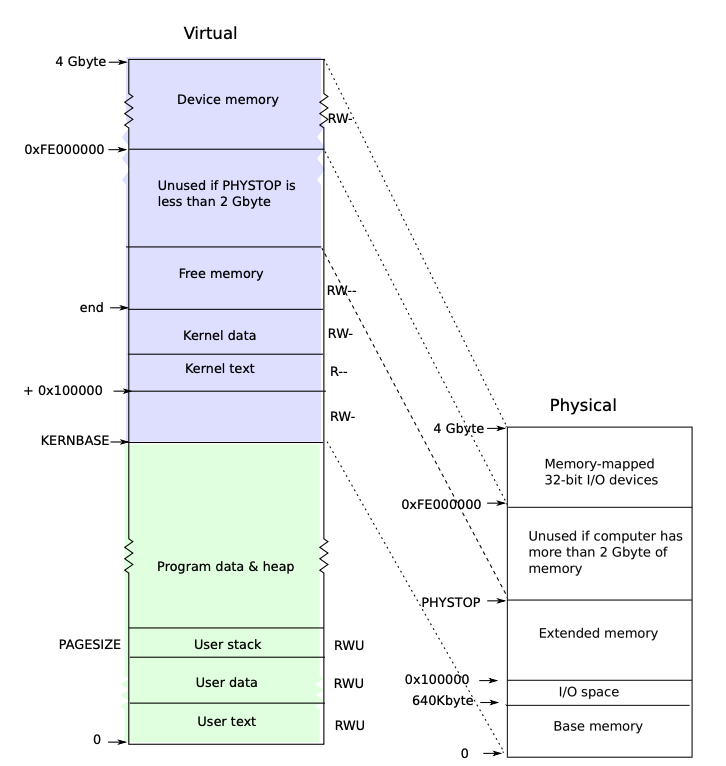
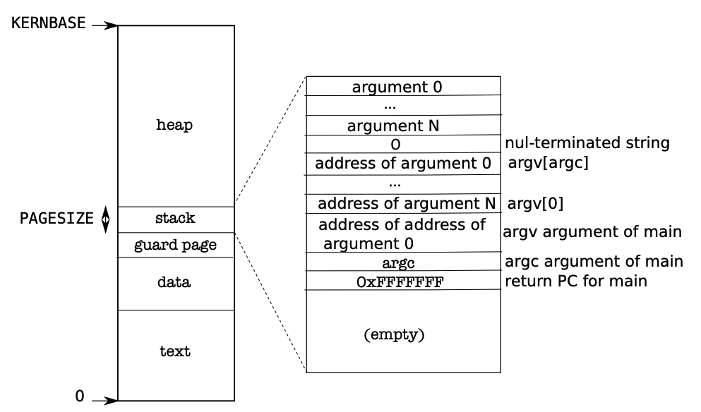
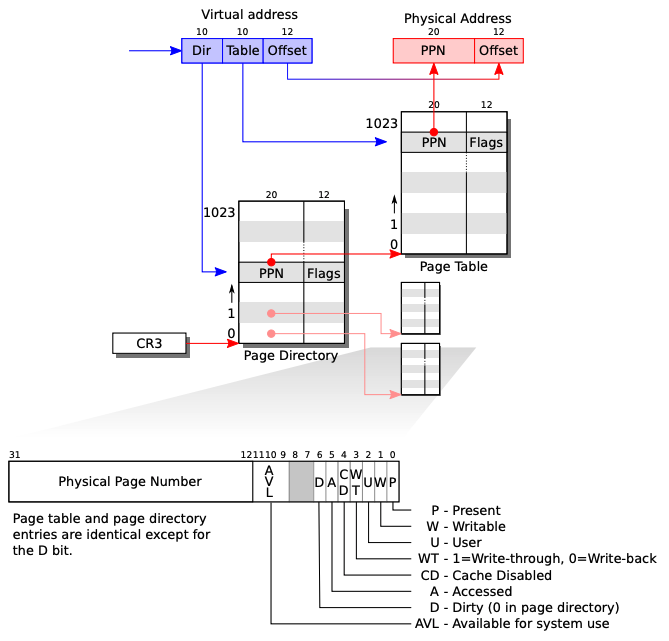

# COMP SCI 537 Discussion Week 9

This project will be easier compared to p4. In today's agenda, we may first walk through the memory-related code of xv6 and then leave some time for exam Q&A.

## Memory Layout

Pictures below are from [xv6 book](https://pdos.csail.mit.edu/6.828/2018/xv6/book-rev11.pdf). You can find them in chapter 2.



xv6 is a 32-bit OS, so its virtual address is of size 4GB (2^32 bytes). The bottom half [0, KERNBASE] is in userspace and the top half is in kernel space. For example, if you try to dereference a pointer `0xFE000000`, you will get a page fault because it is not a valid userspace address and you get a permission denial. This memory layout also implies, for all the processes, their page table entries for memory over KERNBASE is the same (because they share the same kernel).

All the physical memory (`pa`) is directly mapped into the kernel space `kva` so that the kernel could easily access every byte of physical memory. If a page is given to a user process, this page of the physical memory will also be mapped into this process's page table as `uva` (so yes, this physical address may have two associated virtual addresses).

A detailed view of userspace memory layout (the green part of the picture above):



Fun fact: Given this virtual address layout, you may notice you could actually dereference a NULL pointer in xv6 because it is a valid address in xv6 (the first byte in text section).

## Virtual Memory

xv6 uses two-level page table:



Notice there are three available bits in the page table entry, and in this project, you will need to use one of them to indicate this page is encrypted.

Page table in xv6:

```C
typedef uint pde_t; // page directory entry; defined in types.h
typedef uint pte_t; // page table entry; defined in mmu.h

// In mmu.h:
// A virtual address 'la' has a three-part structure as follows:
//
// +--------10------+-------10-------+---------12----------+
// | Page Directory |   Page Table   | Offset within Page  |
// |      Index     |      Index     |                     |
// +----------------+----------------+---------------------+
//  \--- PDX(va) --/ \--- PTX(va) --/

// page directory index
#define PDX(va)         (((uint)(va) >> PDXSHIFT) & 0x3FF)

// page table index
#define PTX(va)         (((uint)(va) >> PTXSHIFT) & 0x3FF)

#define PTXSHIFT        12      // offset of PTX in a linear address
#define PDXSHIFT        22      // offset of PDX in a linear address

#define PGROUNDUP(sz)  (((sz)+PGSIZE-1) & ~(PGSIZE-1))
#define PGROUNDDOWN(a) (((a)) & ~(PGSIZE-1))

// Page table/directory entry flags.
#define PTE_P           0x001   // Present
#define PTE_W           0x002   // Writeable
#define PTE_U           0x004   // User
#define PTE_PS          0x080   // Page Size

////////////////////////////////// [HINT] You may want to define PTE_E here to indicate this page in encrypted

// Address in page table or page directory entry
#define PTE_ADDR(pte)   ((uint)(pte) & ~0xFFF)
#define PTE_FLAGS(pte)  ((uint)(pte) &  0xFFF)

// In memlayout.h
// Memory layout

#define EXTMEM  0x100000            // Start of extended memory
#define PHYSTOP 0xE000000           // Top physical memory
#define DEVSPACE 0xFE000000         // Other devices are at high addresses

// Key addresses for address space layout (see kmap in vm.c for layout)
#define KERNBASE 0x80000000         // First kernel virtual address
#define KERNLINK (KERNBASE+EXTMEM)  // Address where kernel is linked

#define V2P(a) (((uint) (a)) - KERNBASE)
#define P2V(a) ((void *)(((char *) (a)) + KERNBASE))

////////////////////////////////////// [QUIZ] Why virtual <-> physical is just +/- KERNEBASE here? 

#define V2P_WO(x) ((x) - KERNBASE)    // same as V2P, but without casts
#define P2V_WO(x) ((x) + KERNBASE)    // same as P2V, but without casts
```

In `vm.c`: `walkpgdir` returns the page table entry when given a virtual address and the page table directory:

```C
// Return the address of the PTE in page table pgdir
// that corresponds to virtual address va.  If alloc!=0,
// create any required page table pages.
static pte_t *
walkpgdir(pde_t *pgdir, const void *va, int alloc)
{
  pde_t *pde;
  pte_t *pgtab;

  pde = &pgdir[PDX(va)];
  if(*pde & PTE_P){ ///////////////////////////////////////////////// if the page is present
    pgtab = (pte_t*)P2V(PTE_ADDR(*pde));
  } else { ////////////////////////////////////////////////////////// if not present
    if(!alloc || (pgtab = (pte_t*)kalloc()) == 0) ///////////////////    if alloc != 0, allocoate memory (o/w it's an error)
      return 0;
    // Make sure all those PTE_P bits are zero.
    memset(pgtab, 0, PGSIZE); /////////////////////////////////////// set all bits to zero
    // The permissions here are overly generous, but they can
    // be further restricted by the permissions in the page table
    // entries, if necessary.
    *pde = V2P(pgtab) | PTE_P | PTE_W | PTE_U; ////////////////////// set page table directory
  }
  return &pgtab[PTX(va)];
}
```

Other related functions: `kalloc()` allocate a page and return the address of this page.

```C
// Allocate one 4096-byte page of physical memory.
// Returns a pointer that the kernel can use.
// Returns 0 if the memory cannot be allocated.
char*
kalloc(void)
{
  struct run *r;

  if(kmem.use_lock)
    acquire(&kmem.lock);
  r = kmem.freelist;
  if(r)
    kmem.freelist = r->next;
  if(kmem.use_lock)
    release(&kmem.lock);
  return (char*)r;
}
```

## Page Fault

We are using page fault to decrypt the data. When the user accesses an encrypted page, we (the kernel) want to decrypt the data before it actually see the data. To do this, we use page fault as a hack. We clear the "present" bit of this page so every time the user tries to access this page, the CPU will trigger a page fault and ask the kernel to handle. The kernel can then involve to decrypt the data.

The page fault is also a trap. Its trap number is defined in `traps.h`

```C
#define T_PGFLT         14      // page fault
```

In `trap.c`, let's take another look at the trap handler:

```C
void
trap(struct trapframe *tf)
{
// ...
  switch(tf->trapno){
  case T_IRQ0 + IRQ_TIMER:
    // ...
  case T_IRQ0 + IRQ_IDE:
    // ...
  case T_IRQ0 + IRQ_IDE+1:
    // ...
  case T_IRQ0 + IRQ_KBD:
    // ...
  case T_IRQ0 + IRQ_COM1:
    // ...
  case T_IRQ0 + 7:
  case T_IRQ0 + IRQ_SPURIOUS:
    // ...
  default:
    if(myproc() == 0 || (tf->cs&3) == 0){
      // In kernel, it must be our mistake.
      cprintf("unexpected trap %d from cpu %d eip %x (cr2=0x%x)\n",
              tf->trapno, cpuid(), tf->eip, rcr2());
      panic("trap");
    }
    // In user space, assume process misbehaved.
    cprintf("pid %d %s: trap %d err %d on cpu %d "
            "eip 0x%x addr 0x%x--kill proc\n",
            myproc()->pid, myproc()->name, tf->trapno,
            tf->err, cpuid(), tf->eip, rcr2());
    myproc()->killed = 1;
  }
}
```

You may notice there is no `case` for  `T_PGFLT`, which means it will fall into `default`, whose behavior is to kill the process. Now you need to add a `case` for `T_PGFLT` to decide whether it is indeed an invalid memory access or just access an encrypted memory. If it is an encrypted memory, you need to decrypt it instead.

## Hints

### Quick Summary of Memory Translation

Denote: `uva` for userspace virtual address; `pa` for physical address; `kva` for kernel virtual address.

For each physical address `pa`, it must have a kernel virtual address `kva` so that the kernel could access it directly. If this memory is given to the user procee, it will also be mapped to another virtual addrss in this process's page table as `uva`.

- `uva` -> `pa`: `walkpgdir()` returns a `pte_t` that contains `pa`
- `pa` -> `kva`: `P2V()`
- `kva` -> `pa`: `V2P()`

### Never Dereference a Physical Address

You should never dereference a physical address! All memory address in CPU must go through MMU, which translates virtual memory to physical memory, so your memory access must use virtual address so that MMU could translate correctly for you. For example, suppose you get a physical address (likely from some page table entry) and you want to read the data in this physical address:

```C
pte_t *pte = foobar();
char* addr = P2V(PTE_ADDR(*pte)); // 
```

In other words, the physical address should always be saved as `uint`, instead of a pointer. Recall: `#define V2P(a) (((uint) (a)) - KERNBASE)`. This also gives you a hint that all the addresses of some pointer type must be a virtual address.


